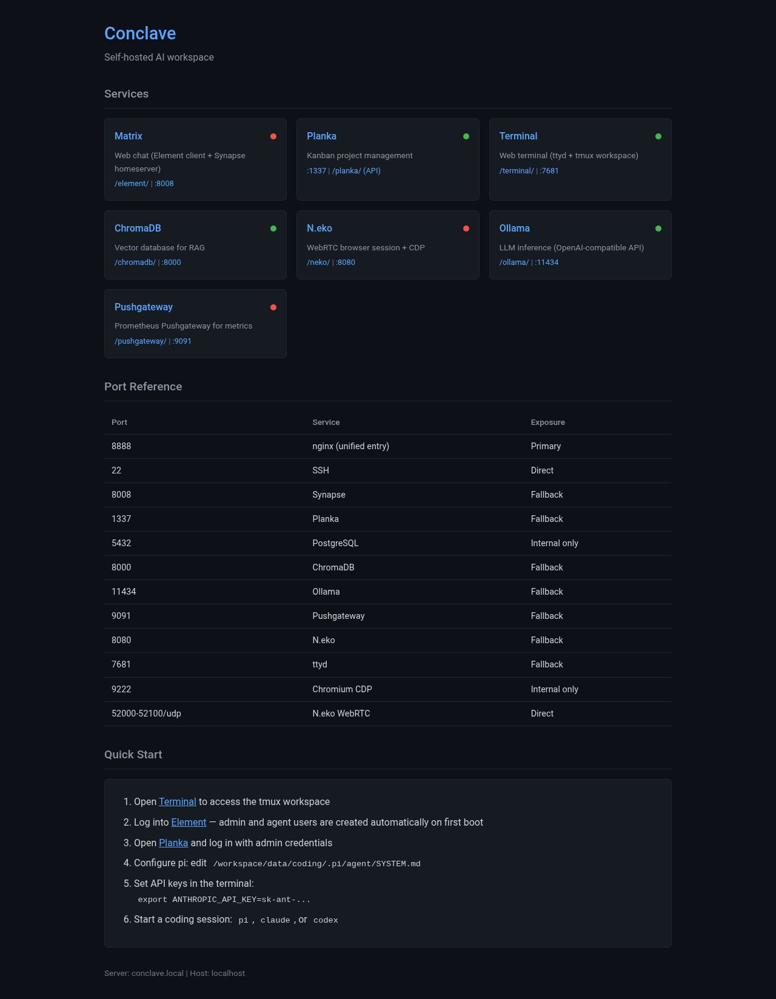

# 🤫 Conclave

A self-hosted AI workspace in a single container. Conclave runs Matrix chat, a kanban board, AI coding agents, LLM inference, a vector database, and a remote browser session — all managed by supervisord behind an nginx reverse proxy, deployed as one unit onto a GPU pod.

## 🕵️ Coding Agents

The container includes three coding agent CLIs, each launched in its own tmux window:

| Agent | tmux window | Description |
|---|---|---|
| [Pi](https://github.com/badlogic/pi-mono) | `pi` | Multi-provider coding agent |
| [Claude Code](https://github.com/anthropics/claude-code) | `claude` | Anthropic's CLI for Claude |
| [Codex](https://github.com/openai/codex) | `codex` | OpenAI's coding CLI |

A fourth window (`dev`) provides a plain bash shell. The tmux session is pre-created by supervisord and shared across ttyd and SSH connections.

### Pi Model Configuration

Pi is configured with six providers in `configs/coding/pi-models.json`:

| Provider | Models | API Key |
|---|---|---|
| **ollama** | Qwen3 Coder 30B-A3B Q8 (local) | — |
| **anthropic** | Claude Opus 4.6, Sonnet 4.6, Haiku 4.5 | `ANTHROPIC_API_KEY` |
| **minimax** | MiniMax M2.5 | `MINIMAX_API_KEY` |
| **openai** | o3-pro, o3, o4-mini, GPT-5.2, GPT-4.1 | `OPENAI_API_KEY` |
| **openrouter** | Gemini 2.5 Pro, DeepSeek R1 | `OPENROUTER_API_KEY` |

The configuration uses the provider format with per-provider `baseUrl`, `api`, and `apiKey` fields. API keys named in UPPER_CASE are resolved from environment variables at runtime.

## 🏰 Services

| Service | Port | Path | Description |
|---|---|---|---|
| [nginx](https://github.com/nginx/nginx) | 8888 | `/` | Unified reverse proxy and dashboard |
| [Matrix Synapse](https://github.com/element-hq/synapse) | 8008 | `/_matrix/` | Chat homeserver |
| [Element Web](https://github.com/element-hq/element-web) | — | `/element/` | Matrix web client (static files) |
| [PostgreSQL 16](https://github.com/postgres/postgres) | 5432 | — | Shared database (Synapse + Planka) |
| [Planka](https://github.com/plankanban/planka) | 1337 | `/planka/` | Kanban project management |
| [ChromaDB](https://github.com/chroma-core/chroma) | 8000 | `/chromadb/` | Vector database for RAG |
| [Ollama](https://github.com/ollama/ollama) | 11434 | `/ollama/` | LLM inference (OpenAI-compatible API) |
| [N.eko](https://github.com/m1k1o/neko) | 8080 | `/neko/` | WebRTC remote browser session (TCPMUX on `NEKO_TCPMUX_PORT`, default 8081) |
| [Pushgateway](https://github.com/prometheus/pushgateway) | 9091 | `/pushgateway/` | Prometheus Pushgateway for metrics |
| Chromium CDP | 9222 | — | Browser automation (internal) |
| [ttyd](https://github.com/tsl0922/ttyd) | 7681 | `/terminal/` | Web terminal (tmux) |
| cron | — | — | System cron daemon (reads `/workspace/config/cron/crontab`) |
| [OpenSSH](https://github.com/openssh/openssh-portable) | 22 | — | Shell access as `dev` user |



## 📜 Skills

Shared skills available to all three coding agents (Pi, Claude Code, Codex). Located in `pi/skills/` and symlinked into each agent's skill directory.

| Skill | Description |
|---|---|
| [Browser Connect](pi/skills/browser-connect/SKILL.md) | Connect to Chromium via CDP for automation, screenshots, and cookie management |
| [ChromaDB](pi/skills/chromadb/SKILL.md) | Semantic search and vector storage using ChromaDB |
| [ComfyUI Generate](pi/skills/comfyui-generate/SKILL.md) | Generate images via ComfyUI API with Flux/LoRA support, plus image-to-video |
| [ComfyUI Info](pi/skills/comfyui-info/SKILL.md) | Discover available ComfyUI resources — models, LoRAs, workflows, system status |
| [ComfyUI Queue](pi/skills/comfyui-queue/SKILL.md) | Track, download, cancel, and monitor ComfyUI jobs |
| [Conclave Build](pi/skills/conclave-build/SKILL.md) | Build, test, and iterate on the Conclave container |
| [Conclave Launch](pi/skills/conclave-launch/SKILL.md) | Launch a Conclave workspace on Runpod |
| [Discord](pi/skills/discord/SKILL.md) | Send messages, read channels, upload files, create polls, and add reactions on Discord |
| [Healthcheck](pi/skills/healthcheck/SKILL.md) | Check the health of all Conclave services |
| [Image Optimize](pi/skills/image-optimize/SKILL.md) | Resize, compress, and format images for platform-specific requirements |
| [Matrix](pi/skills/matrix/SKILL.md) | Send messages, read channels, upload files, manage reactions, and list rooms |
| [Obsidian Import](pi/skills/obsidian-import/SKILL.md) | Import an Obsidian vault into ChromaDB with heading-based chunking |
| [Ollama](pi/skills/ollama/SKILL.md) | Local LLM generation for captioning, prompt generation, and creative writing |
| [Planka](pi/skills/planka/SKILL.md) | Manage tasks and projects in the Planka kanban board |
| [Project Planning](pi/skills/project-planning/SKILL.md) | Interview-driven planning to produce specs and Planka cards |
| [Prometheus](pi/skills/prometheus/SKILL.md) | Push metrics to Prometheus Pushgateway |
| [Self-Reflection](pi/skills/self-reflection/SKILL.md) | Review context, identify gaps, and refine approaches |
| [Skill Creator](pi/skills/skill-creator/SKILL.md) | Create and validate new skills with proper structure and conventions |
| [SQLite](pi/skills/sqlite/SKILL.md) | Execute SQL queries against a SQLite database |
| [Systematic Debugging](pi/skills/systematic-debugging/SKILL.md) | 4-phase debugging process for finding root cause of issues |
| [Take Note](pi/skills/take-note/SKILL.md) | Capture notes and context into ChromaDB for long-term memory |
| [Web Browse](pi/skills/web-browse/SKILL.md) | Browse the web — screenshots, text extraction, and JavaScript execution |
| [Web Search](pi/skills/web-search/SKILL.md) | Search the web for documentation, troubleshooting, and current information |

Skills follow the [Agent Skills](https://agentskills.io/) standard (`SKILL.md` format). Many were inspired by or adapted from:

- [anthropics/skills](https://github.com/anthropics/skills/tree/main/skills) — Anthropic's official skill examples
- [badlogic/pi-skills](https://github.com/badlogic/pi-skills) — Pi's default skill collection
- [ssube/pi-skills](https://github.com/ssube/pi-skills) — Additional Pi skills
- [espennilsen/aivena](https://github.com/espennilsen/aivena) — AI-powered development skills
- [obra/superpowers](https://github.com/obra/superpowers) — Agent capability extensions
- [The Complete Guide to Building Skills for Claude](https://resources.anthropic.com/hubfs/The-Complete-Guide-to-Building-Skill-for-Claude.pdf?hsLang=en) (PDF)

## 🚪 Quick Start

### Docker Compose (recommended)

```bash
docker compose up -d
```

Edit `docker-compose.yml` to set credentials, external URLs, and N.eko WebRTC options. See comments in the file for all available environment variables.

### Dev script

Build and run locally with the dev script:

```bash
bash scripts/dev.sh
```

This builds the Docker image from source and starts the container with sensible defaults. Once running, the script prints all service URLs and credentials:

- **Dashboard:** http://localhost:8888 (user: `admin`, password: auto-generated)
- **Element:** http://localhost:8888/element/
- **Planka:** http://localhost:1337
- **N.eko:** http://localhost:8888/neko/
- **Terminal:** http://localhost:7681
- **ChromaDB:** http://localhost:8000
- **Ollama:** http://localhost:11434
- **Synapse:** http://localhost:8008
- **SSH:** `ssh -p 2222 dev@localhost`

After first-boot setup completes, auto-generated credentials (Matrix admin password, etc.) are printed to the console.

Subcommands: `build`, `run`, `stop`, `logs`. Override the container runtime with `CONTAINER_RUNTIME=podman`.

## 📦 Container Images

Pre-built images are available on Docker Hub:

| Image | Description |
|---|---|
| [`ssube/conclave:latest`](https://hub.docker.com/r/ssube/conclave) | Full image — all services including N.eko, Ollama, and GPU support |
| [`ssube/conclave-minimal:latest`](https://hub.docker.com/r/ssube/conclave-minimal) | Minimal image — no Matrix, Planka, Ollama, or GPU dependencies |

The minimal image (`Dockerfile.minimal`) is based on `ubuntu:22.04` instead of NVIDIA CUDA, with several services disabled at build time:

| Service | Full | Minimal |
|---|:---:|:---:|
| nginx | ✅ | ✅ |
| ChromaDB | ✅ | ✅ |
| N.eko | ✅ | ✅ |
| Chromium CDP | ✅ | ✅ |
| ttyd | ✅ | ✅ |
| OpenSSH | ✅ | ✅ |
| cron | ✅ | ✅ |
| Matrix Synapse | ✅ | — |
| Element Web | ✅ | — |
| PostgreSQL | ✅ | — |
| Planka | ✅ | — |
| Ollama | ✅ | — |
| Pushgateway | ✅ | — |
| GPU support | ✅ | — |

## ☁️ Runpod Deployment

Deploy to a Runpod GPU pod:

```bash
export RUNPOD_API_KEY="your-api-key"

bash scripts/launch-runpod.sh \
    --gpu a100-80 \
    --image your-registry/conclave:latest \
    --env CONCLAVE_ADMIN_PASSWORD=your-password \
    --env ANTHROPIC_API_KEY=sk-... \
    --env SSH_AUTHORIZED_KEYS="ssh-ed25519 AAAA..."
```

GPU presets: `a6000` (48GB), `a100-80` (80GB, default), `l6000` (48GB), `6000-pro` (96GB). Use `--gpu-type` for a raw Runpod GPU type ID.

Other options: `--image`, `--volume-size`, `--name`, `--env KEY=VALUE` (repeatable).

## 🗝️ Environment Variables

| Variable | Required | Default | Description |
|---|---|---|---|
| `CONCLAVE_ADMIN_PASSWORD` | No | auto-generated | Single admin password for all services (nginx, Matrix, Planka, Neko, ttyd, dev SSH) |
| `CONCLAVE_AGENT_PASSWORD` | No | auto-generated | Single agent password for all services (Matrix agent, Planka agent) |
| `MATRIX_SERVER_NAME` | No | `conclave.local` | Matrix server domain |
| `EXTERNAL_HOSTNAME` | No | `localhost` | Pod's external hostname |
| `NGINX_USER` | No | `admin` | nginx basic auth username |
| `NGINX_PASSWORD` | No | `$CONCLAVE_ADMIN_PASSWORD` | Override nginx password separately |
| `TTYD_USER` | No | `admin` | Web terminal username |
| `PLANKA_ADMIN_EMAIL` | No | `admin@local` | Planka admin email |
| `DEFAULT_OLLAMA_MODEL` | No | `qwen3-coder:30b-a3b-q8_0` | Model to pre-pull on first boot |
| `ANTHROPIC_API_KEY` | No | — | API key for Claude Code and Pi (Anthropic provider) |
| `OPENAI_API_KEY` | No | — | API key for Pi (OpenAI provider) |
| `MINIMAX_API_KEY` | No | — | API key for Pi (MiniMax provider) |
| `OPENROUTER_API_KEY` | No | — | API key for Pi (OpenRouter provider) |
| `SSH_AUTHORIZED_KEYS` | No | — | SSH public keys (newline-separated) |
| `CONCLAVE_DEV_PASSWORD` | No | `$CONCLAVE_ADMIN_PASSWORD` | Password for `dev` user (updated on each boot) |
| `CONCLAVE_AGENT_USER` | No | `pi` | Username for the agent user in Matrix and Planka |
| `TZ` | No | `UTC` | Container timezone (e.g. `America/New_York`) |
| `CONCLAVE_PUSHGATEWAY_ENABLED` | No | `true` | Enable Prometheus Pushgateway |
| `CONCLAVE_CRON_ENABLED` | No | `true` | Enable cron daemon (reads `/workspace/config/cron/crontab`) |
| `NEKO_TCPMUX_PORT` | No | `8081` | N.eko TCPMUX port (set to NodePort value in k8s) |
| `NEKO_NAT1TO1` | No | `$EXTERNAL_HOSTNAME` | IP address for WebRTC ICE candidates (set to node IP in k8s) |
| `CONCLAVE_SETUP_ONLY` | No | — | Set to `1` to run setup and exit (for testing) |

`CONCLAVE_ADMIN_PASSWORD` and `CONCLAVE_AGENT_PASSWORD` are auto-generated on first boot if not provided. Database passwords (`SYNAPSE_DB_PASSWORD`, `PLANKA_DB_PASSWORD`), `PLANKA_SECRET_KEY`, and `CHROMADB_TOKEN` are also auto-generated. All secrets are saved to `/workspace/config/generated-secrets.env`.

## 🕯️ First Boot

On first start, `startup.sh` automatically:

1. Creates the `/workspace/{config,data,logs}/` directory tree
2. Generates secrets for any not provided via environment variables
3. Initializes PostgreSQL and creates `synapse` + `planka` databases
4. Generates Synapse homeserver config
5. Renders config templates (nginx, Element Web, Planka, ChromaDB, N.eko)
6. Installs SSH authorized keys (if `SSH_AUTHORIZED_KEYS` is set)
7. Writes agent credentials to `/workspace/config/agent-env.sh`
8. Runs user startup scripts from `/workspace/config/startup.d/*.sh` (if any)
9. Starts supervisord (all services come up in priority order; also includes any `.conf` files from `/workspace/config/supervisor.d/`)
10. Pulls the default Ollama model in the background
11. Creates admin and agent users in Matrix and Planka (background oneshot)
12. Creates a `#home` room in Matrix and invites the agent user
13. Creates a "Work" project in Planka with a "Tasks" board and To Do / In Progress / Done lists

Subsequent boots skip database initialization and secret generation, re-render configs (including agent-env.sh), and start supervisord. User and resource creation is idempotent — existing users, rooms, and projects are skipped.

## 🔑 SSH Access

SSH is configured for key-based authentication only. Pass your public key(s) via the `SSH_AUTHORIZED_KEYS` environment variable:

```bash
docker run -e SSH_AUTHORIZED_KEYS="$(cat ~/.ssh/id_ed25519.pub)" ...
```

Connect as the `dev` user:

```bash
ssh -p 2222 dev@localhost        # local dev
ssh dev@{pod-id}-22.proxy.runpod.net  # Runpod
```

Keys are written to `/workspace/data/coding/.ssh/authorized_keys` on the persistent volume.

## 🪪 Agent Credentials

On each boot, `startup.sh` writes `/workspace/config/agent-env.sh` with credentials for the coding agents (Pi, Claude Code, Codex) to authenticate to Conclave services. This file is sourced into tmux sessions automatically.

Available environment variables in the tmux session:

| Variable | Description |
|---|---|
| `AGENT_MATRIX_USER` | Matrix username for the agent |
| `AGENT_MATRIX_PASSWORD` | Matrix password for the agent |
| `AGENT_MATRIX_URL` | Matrix homeserver URL |
| `AGENT_MATRIX_SERVER_NAME` | Matrix server name |
| `AGENT_PLANKA_USER` | Planka username for the agent |
| `AGENT_PLANKA_EMAIL` | Planka email for the agent |
| `AGENT_PLANKA_PASSWORD` | Planka password for the agent |
| `AGENT_PLANKA_URL` | Planka base URL |
| `AGENT_NEKO_PASSWORD` | N.eko admin password |
| `AGENT_CHROMADB_TOKEN` | ChromaDB auth token |
| `AGENT_CHROMADB_URL` | ChromaDB API URL |
| `AGENT_OLLAMA_URL` | Ollama API URL |
| `AGENT_PUSHGATEWAY_URL` | Prometheus Pushgateway URL |

A Matrix admin user (`admin`) and a Planka admin user are also created automatically (see `scripts/create-users.sh`).

## 🧩 Extending Without Rebuilding

All persistent state lives on the `/workspace` volume. Three hook points let you add custom services, startup logic, and cron jobs without rebuilding the container image.

### Custom services (`/workspace/config/supervisor.d/*.conf`)

Drop a standard supervisord program `.conf` file into this directory to run additional services. Files are included by supervisord at startup alongside the built-in services.

```ini
[program:my-service]
command=/workspace/data/coding/my-service --port 9999
autostart=true
autorestart=true
stdout_logfile=/workspace/logs/my-service-stdout.log
stderr_logfile=/workspace/logs/my-service-stderr.log
```

After adding a file, restart the container or run `supervisorctl reread && supervisorctl update` to pick it up without a full restart.

### Startup scripts (`/workspace/config/startup.d/*.sh`)

Shell scripts in this directory run as root on every boot, after config rendering but before supervisord starts. Each script has a timeout of 60 seconds (configurable via `CONCLAVE_STARTUP_TIMEOUT`). Use these for one-time setup like installing packages, downloading models, or configuring services.

### Cron jobs (`/workspace/config/cron/crontab`)

If `CONCLAVE_CRON_ENABLED=true` (the default), this file is installed as the `dev` user's crontab on every boot. Use standard crontab syntax.

## 🔒 Security

- **SSH hardening:** `PermitRootLogin no`, `PasswordAuthentication no`, `X11Forwarding no`, `AllowAgentForwarding no`, `MaxAuthTries 3`, `LoginGraceTime 30`
- **fail2ban:** Jails for `sshd` and `nginx-http-auth` (5 retries, 1-hour ban)
- **Dev user:** Unprivileged `dev` user for interactive sessions (ttyd, SSH). Has `sudo` with password. Root access is not available via SSH.
- **nginx basic auth:** Protects dashboard, Ollama API, and ChromaDB Admin
- **Secrets:** Auto-generated on first boot, stored with `chmod 600`

Validate hardening with:

```bash
sudo bash scripts/test-security.sh
```

## 🛠️ Development

### Building

```bash
docker build -t conclave:latest .                          # full image
docker build -f Dockerfile.minimal -t conclave-minimal .   # minimal image
```

The Dockerfile installs Ansible temporarily, runs the playbook (`ansible/playbook.yml`), then removes Ansible from the final image.

### Running the Ansible playbook directly

```bash
cd ansible && ansible-playbook -i inventory.yml playbook.yml
```

Individual services can be toggled via `ansible/group_vars/all.yml` (e.g., `conclave_neko_enabled: false`).

### Testing

Security tests:

```bash
sudo bash scripts/test-security.sh
```

Runs the Ansible playbook, executes `startup.sh` in setup-only mode, then validates dev user, SSH hardening, fail2ban jails, directory ownership, and supervisord config.

End-to-end tests (requires a running container):

```bash
npm install --no-save playwright && npx playwright install chromium
node scripts/test-e2e.mjs                  # full image
node scripts/test-e2e.mjs --minimal        # minimal image (skips disabled services)
```

Tests all services via Playwright and HTTP: dashboard, Element, Matrix API, ChromaDB, Ollama, terminal, Planka, Neko WebRTC, skills, and the agent healthcheck script.

## 🗺️ Project Structure

```
conclave/
├── Dockerfile                       # Full image (nvidia/cuda base)
├── Dockerfile.minimal               # Minimal image (ubuntu base, no GPU)
├── docker-compose.yml               # Single-host deployment
├── ansible/
│   ├── playbook.yml                 # 12 roles: base → services → security
│   ├── inventory.yml
│   ├── group_vars/all.yml           # Service toggles, versions, ports
│   └── roles/                       # One role per service + ssh + fail2ban
├── scripts/
│   ├── startup.sh                   # Container entrypoint
│   ├── dev.sh                       # Local build + run
│   ├── launch-runpod.sh             # Runpod deployment
│   ├── test-security.sh             # Security validation
│   ├── test-e2e.mjs                 # End-to-end tests (Playwright + HTTP)
│   ├── agent-healthcheck.sh         # Agent-facing health check (all services)
│   ├── init-postgres.sh             # PostgreSQL first-boot
│   ├── init-synapse.sh              # Synapse config generation
│   ├── ollama-pull.sh               # Background model pull
│   ├── create-users.sh              # Post-start user + resource creation
│   ├── tmux-session.sh              # Pre-create tmux session (supervisord)
│   ├── tmux-workspace.sh            # tmux attach/create for ttyd
│   └── healthcheck.sh               # Container health check (Docker)
├── configs/
│   ├── supervisord.conf             # Process manager definitions
│   ├── nginx/nginx.conf.template
│   ├── synapse/homeserver.override.yaml
│   ├── element-web/config.json.template
│   └── coding/{pi-models.json,tmux.conf}
├── pi/skills/                       # Shared skills for all coding agents
├── dashboard/index.html             # Service status page
└── spec.md                          # Full implementation specification
```

## 🏛️ Architecture

Conclave runs all services as native processes managed by **supervisord** inside a single Docker container. The full image is based on `nvidia/cuda:12.4.1-runtime-ubuntu22.04`; the minimal image uses `ubuntu:22.04`.

**Build:** An Ansible playbook with per-service roles runs during `docker build`. Each role installs its service (via apt, pip, npm, or source build), with versions pinned in `ansible/group_vars/all.yml`.

**Runtime:** `startup.sh` handles first-boot initialization (secrets, databases, configs), then hands off to supervisord. All application state persists on the `/workspace` volume across pod restarts.

**Networking:** nginx on port 8888 reverse-proxies all services by path prefix. Each service also listens on its own port for direct access. N.eko uses TCPMUX (single TCP port) for all WebRTC media. The TCPMUX port in ICE candidates must match the externally reachable port:
- **Kubernetes:** Set `NEKO_TCPMUX_PORT` to the NodePort value and `NEKO_NAT1TO1` to the node IP.
- **Runpod:** N.eko is auto-disabled — Runpod remaps all ports dynamically, breaking WebRTC ICE. The browser remains available via CDP (port 9222) for automation.
- **Local dev:** Uses TCPMUX on port 8081 (default), accessible at `localhost:8080`.

**N.eko stability:** N.eko (Pion WebRTC) can get stuck after a failed WebRTC connection, silently dropping all subsequent WebSocket clients without sending any messages. If the N.eko web UI connects but times out waiting for a response, restart the neko process: `supervisorctl restart neko`.
